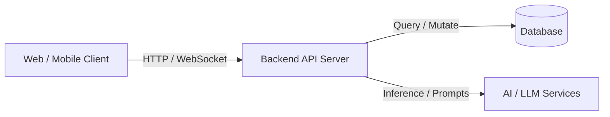

# 🚀 Project Name

> **A catchy one-line tagline describing what your hackathon project does.**

---

## 📌 Table of Contents

- [Overview](#-overview)
- [The Problem](#-the-problem)
- [The Solution](#-the-solution)
- [Key Features](#-key-features)
- [Tech Stack](#-tech-stack)
- [Architecture](#-architecture)
- [Getting Started](#-getting-started)
  - [Prerequisites](#prerequisites)
  - [Installation](#installation)
  - [Running the Project](#running-the-project)
- [Environment Variables](#-environment-variables)
- [Roadmap & Future Improvements](#-roadmap--future-improvements)
- [Team Members](#-team-members)
- [License](#-license)

---

## 💡 Overview

Briefly describe your project here. What inspired you to build this? What track or theme does it target for the hackathon?

- **Demo Video / Pitch Deck**: [Link to demo/slides](#)
- **Live Deployment**: [https://your-project-link.com](#)

---

## ❗ The Problem

- **Pain Point 1**: Describe the specific challenge users face.
- **Pain Point 2**: Why existing solutions fall short or fail.
- **Impact**: How this affects the target audience or industry.

---

## ✨ The Solution

Explain how your project directly addresses the problem above. Highlight the core value proposition and why your approach is innovative.

---

## 🌟 Key Features

- [x] **Feature 1**: Real-time data processing and analytics dashboard.
- [x] **Feature 2**: AI-powered recommendations / automated workflows.
- [x] **Feature 3**: Seamless multi-platform responsive interface.
- [x] **Feature 4**: Secure authentication and end-to-end data privacy.

---

## 🛠 Tech Stack

### Frontend
- React / Next.js / Vue
- Tailwind CSS / Vanilla CSS

### Backend & APIs
- Node.js / Express / Python (FastAPI / Flask)
- REST / GraphQL / WebSockets

### Database & Storage
- PostgreSQL / MongoDB / Supabase / Firebase

### AI / ML & Tools
- OpenAI API / Gemini API / Hugging Face
- Docker / Vercel / GitHub Actions

---

## 🏗 Architecture



---

## 🚀 Getting Started

### Prerequisites

Ensure you have the following installed:
- [Node.js](https://nodejs.org/) (v18+) or [Python](https://python.org/) (v3.10+)
- Package Manager (`npm`, `yarn`, `pnpm`, or `pip`)
- Git

### Installation

1. **Clone the repository:**
   ```bash
   git clone https://github.com/Madhubalakumar07/HACKSPACE---FIGHT-CLUB.git
   cd HACKSPACE---FIGHT-CLUB
   ```

2. **Install frontend dependencies:**
   ```bash
   cd frontend
   npm install
   ```

3. **Install and run the backend:**
   ```bash
   cd ../backend
   py -m pip install -r requirements.txt
   copy .env.example .env
   npm run dev
   ```

   Set `HUGGINGFACE_API_KEY` in `backend/.env` to enable Qwen responses. The frontend
   sends chat requests to `http://localhost:8000` by default; set
   `VITE_API_URL` when the backend is hosted elsewhere.

### Running the Project

```bash
# Inside frontend directory:
npm run dev
```

Open [http://localhost:5173](http://localhost:5173) in your browser.

### AI health reports

Open the LifeFlow Coach drawer and use the paperclip button to upload a text-based
PDF, DOCX, TXT, or Markdown health report (up to 10 MB). The backend extracts common
metrics, returns an educational wellness score, and asks Qwen for a practical 7-day
improvement plan. Uploaded content is processed in memory and is not stored.

This feature is not a diagnosis or a replacement for a clinician. Scanned/image-only
documents are not interpreted unless they contain an extractable text layer.

---

## 🔐 Environment Variables

Create a `.env` file in the root directory and configure the necessary variables:

```env
PORT=3000
DATABASE_URL=your_database_connection_string
API_KEY=your_api_key_here
```

---

## 🗺 Roadmap & Future Improvements

- [ ] Add support for additional third-party integrations
- [ ] Implement advanced analytics & telemetry
- [ ] Mobile application (iOS / Android)

---

## 👥 Team Members

| Name | Role | GitHub / LinkedIn |
| :--- | :--- | :--- |
| **Team Member 1** | Frontend / UI/UX | [@github](https://github.com/) |
| **Team Member 2** | Backend / DevOps | [@github](https://github.com/) |
| **Team Member 3** | AI / Data Science | [@github](https://github.com/) |
| **Team Member 4** | Product / Full-stack | [@github](https://github.com/) |

---

## 📄 License

This project is licensed under the [MIT License](LICENSE).
